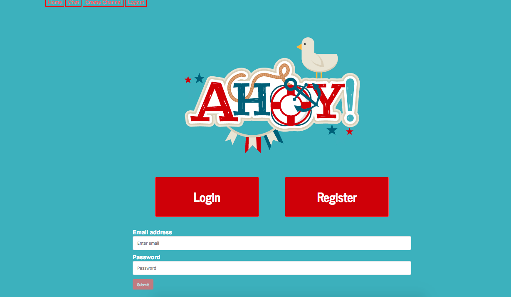
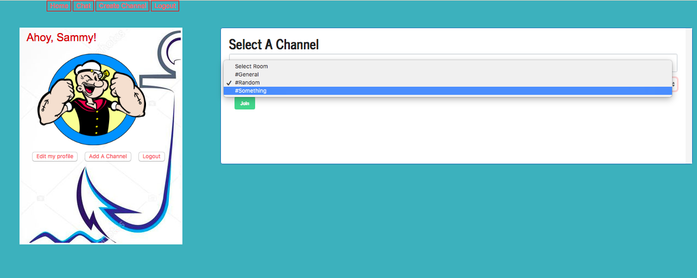
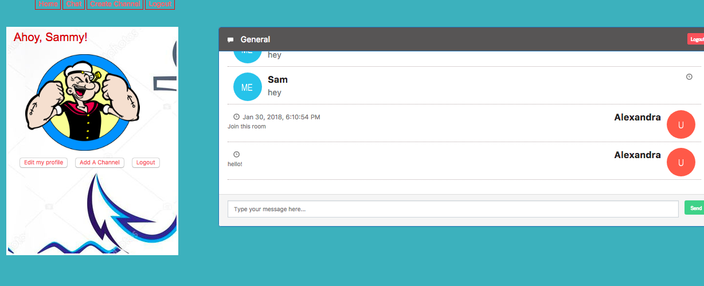

# AHOY MEAN Project
Slack Web Application using MEAN Stack
## Overview
Slack helps all of team's communication together, giving everyone a shared workspace where conversations are organized and accessible. This project contains Javascript, Angular 4, Node.js, and Socket.io. This project timeline: 1 Week; SCRUM methodology.
## Dependencies
``` 
"bcryptjs": "^2.4.3",
"body-parser": "^1.18.2",
"ejs": "^2.5.7",
"express": "^4.16.2",
"express-session": "^1.15.6",
"mongoose": "^4.13.5",
"session": "^0.1.0",
"socket.io": "^2.0.4",
"socket.io-client": "^2.0.4",
"socketio": "^1.0.0"

```
## Technology
- Database: MongoDB
- Express
- Node.js
- Angular 4
- Socket.io
- Twitter Boostrap





